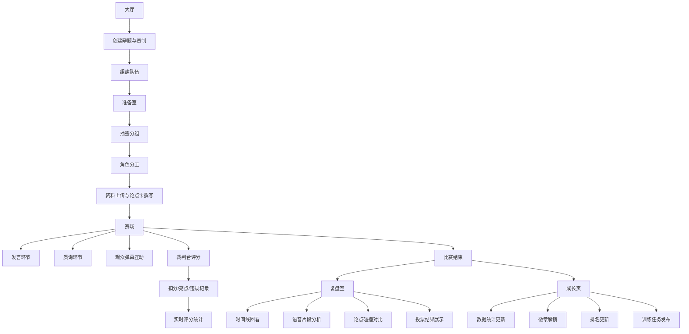

## 1. 产品概述
面向远程辩论社的社交互动平台桌面游戏，提供辩论训练和赛后复盘的完整虚拟环境。通过6个核心场景模拟真实辩论流程，帮助辩手提升辩论技巧，增强团队协作能力。

- **核心价值**：打破地域限制，为远程辩论社提供沉浸式的训练和比赛环境
- **目标用户**：高中/大学辩论社成员、辩论教练、辩论爱好者
- **解决问题**：远程辩论缺乏专业场地支持、训练效率低下、复盘困难等痛点

## 2. 核心特性

### 2.1 用户角色
| 角色 | 注册方式 | 核心权限 |
|------|----------|----------|
| 辩手 | 账号注册 | 参与辩论、准备资料、查看成长数据 |
| 裁判 | 账号注册 + 资质认证 | 评分、记录违规、给出裁判点评 |
| 教练 | 账号注册 + 认证 | 指导训练、查看团队数据、发布任务 |
| 观众 | 游客/注册 | 观看比赛、发送弹幕、参与投票 |

### 2.2 功能模块
1. **大厅**：创建辩题、赛制配置、队伍管理、计时规则设置
2. **准备室**：抽签分组、角色分工、资料上传、论点卡撰写
3. **赛场**：实时发言、质询环节、举牌提示、暂停控制、观众弹幕
4. **裁判台**：扣分记录、亮点标记、违规记录、实时评分
5. **复盘室**：时间线回看、语音片段播放、论点碰撞分析、投票结果展示
6. **成长页**：发言时长统计、回应速度分析、胜率统计、常用论证分析、个人徽章、队伍排名、训练任务

### 2.3 页面详情
| 页面名称 | 模块名称 | 功能描述 |
|----------|----------|----------|
| 大厅 | 辩题管理 | 创建/编辑辩题，设置辩题类型（政策/价值/事实） |
| 大厅 | 赛制配置 | 选择赛制模板（BP/新国辩/奥瑞刚等），自定义各环节时长 |
| 大厅 | 队伍管理 | 创建队伍，邀请成员，设置队长 |
| 大厅 | 计时规则 | 配置各环节计时规则，超时提醒方式 |
| 准备室 | 抽签分组 | 随机抽签决定正反方和发言顺序 |
| 准备室 | 角色分工 | 分配一辩、二辩、三辩、四辩等角色 |
| 准备室 | 资料上传 | 上传参考文献、数据资料、案例材料 |
| 准备室 | 论点卡 | 撰写论点、论据、攻防预案卡片 |
| 赛场 | 发言模块 | 倒计时显示、发言状态、举手申请 |
| 赛场 | 质询模块 | 质询方/被质询方切换、打断规则控制 |
| 赛场 | 举牌模块 | 时间提示牌、违规提示牌、申请发言牌 |
| 赛场 | 暂停控制 | 暂停/继续比赛、技术暂停申请 |
| 赛场 | 弹幕系统 | 观众实时弹幕、弹幕审核、弹幕表情 |
| 裁判台 | 扣分记录 | 按违规类型扣分、扣分原因备注 |
| 裁判台 | 亮点标记 | 标记精彩发言、优秀论证 |
| 裁判台 | 违规记录 | 记录超时、打断、人身攻击等违规 |
| 裁判台 | 实时评分 | 按评分标准打分、实时比分显示 |
| 复盘室 | 时间线 | 比赛完整时间轴、关键节点标记 |
| 复盘室 | 语音片段 | 重要发言片段截取、变速播放 |
| 复盘室 | 论点碰撞 | 正反方论点对比、攻防关系图 |
| 复盘室 | 投票结果 | 各评委打分、最终结果统计 |
| 成长页 | 数据统计 | 发言时长、回应速度、胜率、常用论证 |
| 成长页 | 徽章系统 | 成就徽章、等级提升、解锁条件 |
| 成长页 | 排名系统 | 个人排名、队伍排名、积分榜 |
| 成长页 | 训练任务 | 教练发布任务、任务进度、完成奖励 |

## 3. 核心流程
用户从大厅创建辩论比赛开始，配置赛制和队伍，进入准备室完成抽签和资料准备，然后在赛场进行正式辩论，裁判在裁判台实时评分，比赛结束后进入复盘室进行回顾分析，最后所有数据同步到成长页进行统计和展示。

## 4. 用户界面设计

### 4.1 设计风格
- **设计理念**：专业学术感 + 现代科技感，营造紧张而专注的辩论氛围
- **主色调**：深蓝（#1e3a5f）代表专业与理性，搭配金色（#d4af37）作为荣誉与高光点缀
- **辅助色**：正反方分别使用深红（#c41e3a）和深青（#0d7377），便于区分阵营
- **中性色**：深灰（#1a1a2e）作为背景，浅灰（#e8e8e8）作为文本，保证可读性
- **字体**：标题使用 "Noto Serif SC" 体现学术感，正文使用 "Noto Sans SC" 保证清晰度
- **布局**：模块化卡片布局，各功能区边界清晰，信息层级分明
- **图标**：使用线性图标，保持简洁专业的风格

### 4.2 页面设计概述
| 页面名称 | 模块名称 | UI 元素 |
|----------|----------|----------|
| 大厅 | 主区域 | 辩题卡片网格、赛制模板选择器、队伍列表、计时器配置面板 |
| 大厅 | 交互 | 悬停卡片浮起、创建按钮脉冲动画、平滑过渡 |
| 准备室 | 主区域 | 抽签转盘、角色分配矩阵、资料上传区、论点卡编辑器 |
| 准备室 | 交互 | 抽签旋转动画、卡片拖拽、实时协作光标 |
| 赛场 | 主区域 | 中央舞台（辩手席位）、计时器大屏、弹幕区、举牌面板 |
| 赛场 | 交互 | 发言时头像光环、倒计时闪烁、弹幕飘过动画 |
| 裁判台 | 主区域 | 评分表、扣分面板、亮点标记器、违规记录时间线 |
| 裁判台 | 交互 | 打分滑块、一键扣分按钮、实时分数跳动 |
| 复盘室 | 主区域 | 时间线轨道、视频播放区、论点对比看板、投票统计图表 |
| 复盘室 | 交互 | 时间轴拖拽、片段循环播放、数据可视化动画 |
| 成长页 | 主区域 | 数据仪表盘、徽章墙、排行榜、任务列表 |
| 成长页 | 交互 | 数据加载动画、徽章解锁动效、进度条平滑过渡 |

### 4.3 响应式设计
- **桌面端优先**：针对 1920×1080 及以上分辨率优化，充分利用大屏空间
- **平板适配**：1024px 断点，调整布局为双栏或单栏堆叠
- **移动端**：768px 断点，简化界面，保留核心功能
- **触控优化**：按钮最小尺寸 44px，支持手势操作

### 4.4 动效与微交互
- **页面加载**：各模块按序淡入，配合轻微上移动画
- **状态变化**：颜色渐变过渡，时长 300ms
- **按钮交互**：悬停时放大 1.03 倍，点击时缩小 0.97 倍
- **数据更新**：数字滚动动画，图表柱状图增长动画
- **徽章解锁**：金色光芒放射效果，伴随轻微弹跳
