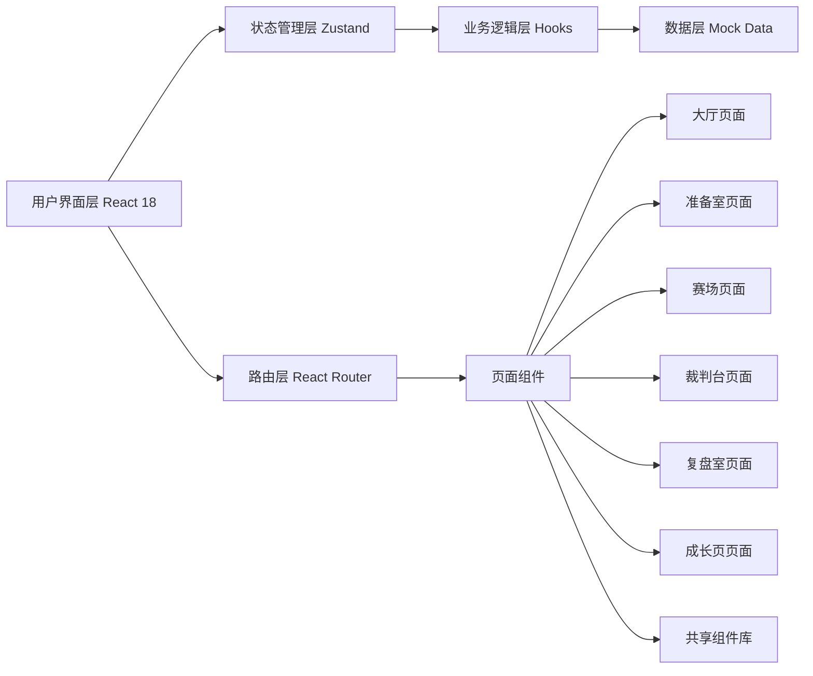
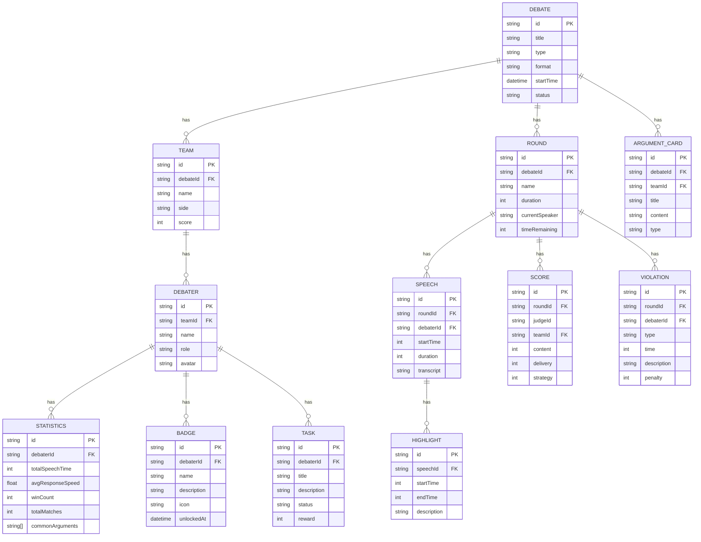

## 1. 架构设计



## 2. 技术描述
- **前端**：React@18 + TypeScript@5 + Vite@5 + Tailwind CSS@3
- **状态管理**：Zustand@4
- **路由**：React Router@6
- **图表可视化**：Recharts@2
- **图标**：Lucide React@0.344
- **动画**：Framer Motion@11
- **后端**：无（纯前端应用，使用 Mock 数据）
- **构建工具**：Vite@5
- **初始化工具**：vite-init

## 3. 路由定义
| 路由 | 页面 | 用途 |
|------|------|------|
| / | 大厅 | 创建辩题、赛制配置、队伍管理 |
| /preparation | 准备室 | 抽签、分工、资料上传、论点卡 |
| /arena | 赛场 | 发言、质询、举牌、弹幕 |
| /judge | 裁判台 | 扣分、亮点、违规、评分 |
| /review | 复盘室 | 时间线、语音、论点碰撞、投票 |
| /growth | 成长页 | 数据统计、徽章、排名、任务 |

## 4. 数据模型

### 4.1 数据模型定义



### 4.2 Mock 数据结构

```typescript
// 辩论比赛
interface Debate {
  id: string;
  title: string;
  type: 'policy' | 'value' | 'fact';
  format: 'bp' | 'nsda' | 'australasian' | 'custom';
  startTime: Date;
  status: 'preparing' | 'ongoing' | 'finished';
  teams: Team[];
  rounds: Round[];
  timerRules: TimerRule[];
}

// 队伍
interface Team {
  id: string;
  name: string;
  side: 'affirmative' | 'negative';
  debaters: Debater[];
  score: number;
}

// 辩手
interface Debater {
  id: string;
  name: string;
  role: 'first' | 'second' | 'third' | 'fourth';
  avatar: string;
  isSpeaking: boolean;
}

// 比赛环节
interface Round {
  id: string;
  name: string;
  duration: number;
  currentSpeaker: string | null;
  timeRemaining: number;
  speeches: Speech[];
  scores: Score[];
  violations: Violation[];
}

// 发言记录
interface Speech {
  id: string;
  debaterId: string;
  startTime: number;
  duration: number;
  transcript: string;
  highlights: Highlight[];
}

// 评分
interface Score {
  id: string;
  judgeId: string;
  teamId: string;
  content: number;
  delivery: number;
  strategy: number;
  total: number;
}

// 违规记录
interface Violation {
  id: string;
  debaterId: string;
  type: 'timeout' | 'interruption' | 'personal_attack' | 'other';
  time: number;
  description: string;
  penalty: number;
}

// 亮点标记
interface Highlight {
  id: string;
  startTime: number;
  endTime: number;
  description: string;
  isExcellent: boolean;
}

// 论点卡
interface ArgumentCard {
  id: string;
  teamId: string;
  title: string;
  content: string;
  type: 'argument' | 'evidence' | 'rebuttal';
  createdAt: Date;
}

// 计时规则
interface TimerRule {
  id: string;
  roundName: string;
  duration: number;
  warningTime: number;
  overtimeAllowed: boolean;
}

// 弹幕
interface Danmaku {
  id: string;
  userId: string;
  userName: string;
  content: string;
  timestamp: number;
  color: string;
}

// 统计数据
interface Statistics {
  debaterId: string;
  totalSpeechTime: number;
  avgResponseSpeed: number;
  winCount: number;
  totalMatches: number;
  winRate: number;
  commonArguments: string[];
}

// 徽章
interface Badge {
  id: string;
  name: string;
  description: string;
  icon: string;
  unlocked: boolean;
  unlockedAt?: Date;
  requirement: string;
}

// 训练任务
interface TrainingTask {
  id: string;
  title: string;
  description: string;
  status: 'pending' | 'in_progress' | 'completed';
  deadline: Date;
  reward: number;
  progress: number;
}
```

## 5. 项目结构

```
src/
├── components/           # 共享组件
│   ├── layout/          # 布局组件
│   │   ├── Header.tsx
│   │   ├── Navigation.tsx
│   │   └── Container.tsx
│   ├── ui/              # UI 基础组件
│   │   ├── Button.tsx
│   │   ├── Card.tsx
│   │   ├── Modal.tsx
│   │   ├── Input.tsx
│   │   ├── Timer.tsx
│   │   ├── ProgressBar.tsx
│   │   └── Avatar.tsx
│   └── features/        # 业务组件
│       ├── DebateCard.tsx
│       ├── TeamCard.tsx
│       ├── DebaterCard.tsx
│       ├── ArgumentCardComponent.tsx
│       ├── DanmakuItem.tsx
│       ├── ScoreSlider.tsx
│       └── BadgeIcon.tsx
├── pages/               # 页面组件
│   ├── Lobby.tsx        # 大厅
│   ├── Preparation.tsx  # 准备室
│   ├── Arena.tsx        # 赛场
│   ├── JudgePanel.tsx   # 裁判台
│   ├── ReviewRoom.tsx   # 复盘室
│   └── GrowthPage.tsx   # 成长页
├── store/               # 状态管理
│   ├── useDebateStore.ts
│   ├── useUserStore.ts
│   └── useUiStore.ts
├── hooks/               # 自定义 Hooks
│   ├── useTimer.ts
│   ├── useSpeech.ts
│   ├── useDanmaku.ts
│   └── useStatistics.ts
├── types/               # 类型定义
│   └── index.ts
├── data/                # Mock 数据
│   ├── mockDebates.ts
│   ├── mockDebaters.ts
│   ├── mockBadges.ts
│   └── mockStatistics.ts
├── utils/               # 工具函数
│   ├── time.ts
│   ├── format.ts
│   └── animation.ts
├── App.tsx
├── main.tsx
└── index.css
```

## 6. 关键技术决策

### 6.1 状态管理
- 使用 Zustand 进行全局状态管理，避免 Redux 的繁琐配置
- 按领域拆分 store：辩论状态、用户状态、UI 状态
- 使用 Immer 进行不可变状态更新

### 6.2 动画方案
- 使用 Framer Motion 实现复杂动画
- 页面切换动画、卡片悬停效果、徽章解锁动画
- CSS 变量控制动画时长和缓动函数

### 6.3 样式方案
- Tailwind CSS 3 进行原子化样式开发
- 自定义主题配置：颜色、字体、间距
- CSS 变量定义主题色和组件样式变量

### 6.4 性能优化
- 使用 React.memo 优化列表渲染
- 虚拟滚动处理长列表
- 防抖/节流处理高频事件
- 图片懒加载

### 6.5 数据持久化
- localStorage 存储用户偏好和草稿数据
- IndexedDB 存储辩论记录和统计数据
